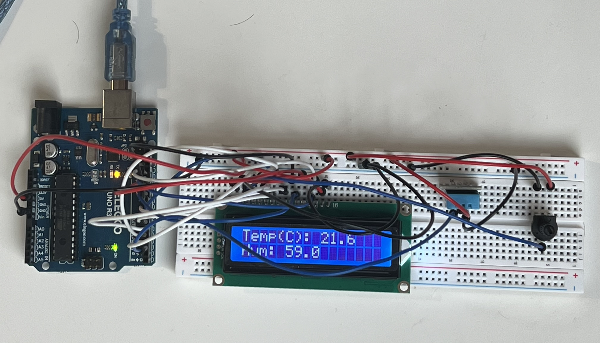
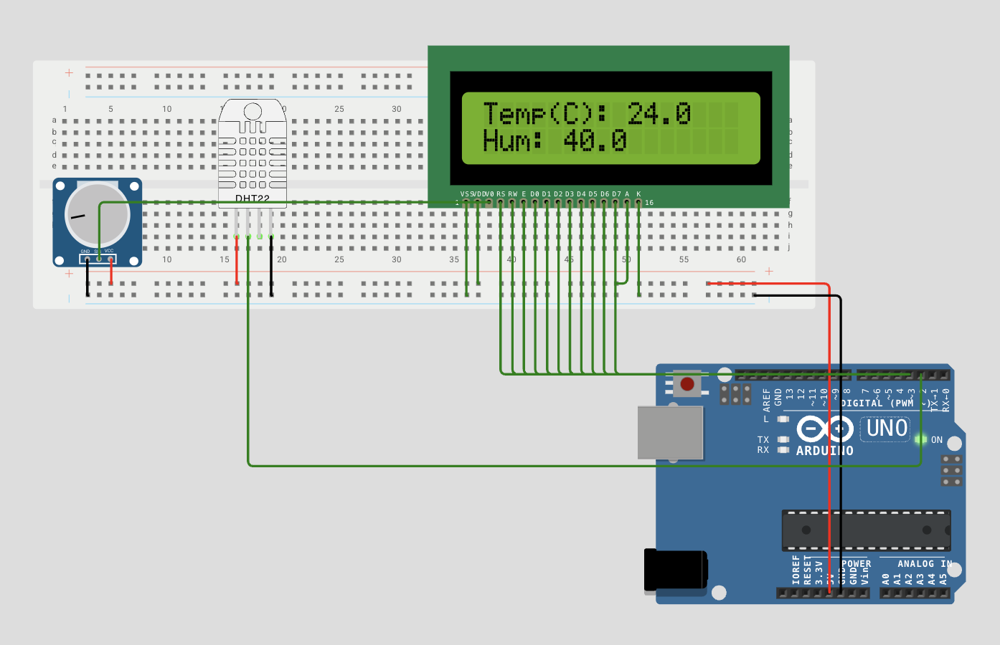

# Arduino Environmental Monitor (8-Bit Parallel Architecture)

*Live temperature and humidity polling via the completed hardware node.*

## Overview
This repository contains the C++ logic and hardware mapping for an Arduino-based environmental monitoring system. It reads real-time temperature and humidity data via a DHT11/DHT22 sensor and displays it on a standard 16x2 character LCD.

To ensure fast, reliable data transmission and precise manual control over the hardware logic, the LCD is wired using a full **8-bit parallel data bus** rather than relying on an abstracted I2C backpack. 

## System Architecture

### Block Diagram

*Data flow from the DHT11 sensor through the ATmega328P to the 8-bit parallel LCD display.*

### Hardware Components
* **Microcontroller:** Elegoo UNO R3 (Arduino-compatible ATmega328P)
* **Sensor:** DHT11 Digital Temperature & Humidity Sensor
* **Display:** 16x2 Character LCD (HD44780 compatible)
* **Contrast Control:** 10KΩ Potentiometer

### Pin Mapping (8-Bit Parallel Logic)
The ATmega328P directly controls the LCD's instruction registers and data lines sequentially across Digital Pins 3 through 13.

| Component / Pin | Function | Arduino Pin |
| :--- | :--- | :--- |
| **DHT Sensor** | Data Line | D2 |
| **LCD RS** | Register Select | D3 |
| **LCD R/W** | Read / Write | D4 |
| **LCD E** | Enable | D5 |
| **LCD D0 - D7** | 8-Bit Data Bus | D6 - D13 |

*Hardware Note:* The 10KΩ potentiometer is wired across the breadboard's center gap to isolate the 5V/GND power rails from the contrast signal (V0) sent to LCD Pin 3, preventing accidental power shorts.

## Code Structure & Logic
The system utilizes a non-blocking `millis()` timer loop. Instead of halting the ATmega328P with a standard `delay()` function, the microcontroller continuously evaluates the elapsed time. 

This architecture ensures the primary loop remains fully open for concurrent multitasking, polling additional sensors, and rapidly processing state flags triggered by hardware interrupts, all while maintaining a precise 2000ms screen refresh rate.

## Live Simulation
Before deploying to physical hardware, the circuit logic and C++ implementation were verified using Wokwi. 

*Click the image or the link below to view the live circuit logic.*
**[View Interactive Wokwi Simulation](https://wokwi.com/projects/464816320305271809)**

## Getting Started
1. Clone this repository to your local machine.
2. Open the source code in your preferred IDE (Arduino IDE or VS Code with the Arduino extension).
3. Ensure the **Adafruit DHT Sensor Library** and the built-in **LiquidCrystal** library are installed.
4. Compile and flash the code to the UNO via USB.
